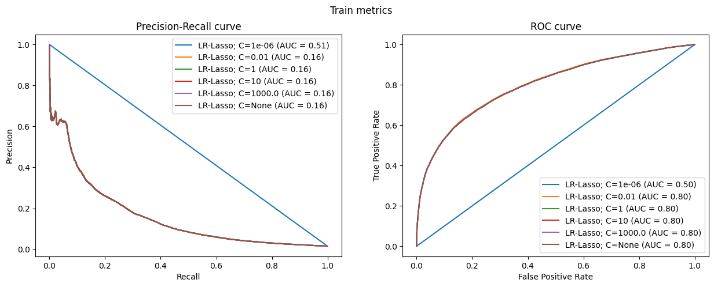
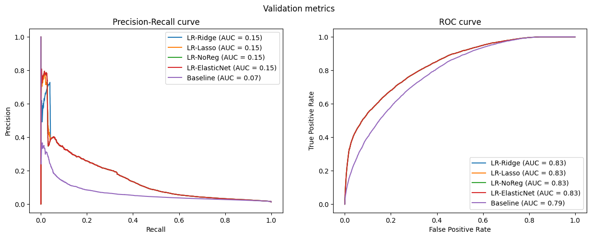

```python
%reset -f
```


```python
import matplotlib
import matplotlib.pyplot as plt
import numpy as np
import os
import pandas as pd
import seaborn as sns

from typing import List, Tuple
from sklearn.linear_model import LogisticRegression
from sklearn.metrics import precision_recall_curve, roc_curve, auc, roc_auc_score
from sklearn.pipeline import Pipeline, make_pipeline
from sklearn.preprocessing import StandardScaler
from pathlib import Path
from IPython.display import display
```


```python
DATA_PATH = "/home/alejandro/Zrive"

df = pd.read_csv(Path(DATA_PATH, "feature_frame.csv"))
```


```python
print(df.head())
```

           variant_id     product_type       order_id        user_id  \
    0  33826472919172  ricepastapulses  2807985930372  3482464092292   
    1  33826472919172  ricepastapulses  2808027644036  3466586718340   
    2  33826472919172  ricepastapulses  2808099078276  3481384026244   
    3  33826472919172  ricepastapulses  2808393957508  3291363377284   
    4  33826472919172  ricepastapulses  2808429314180  3537167515780   
    
                created_at           order_date  user_order_seq  outcome  \
    0  2020-10-05 16:46:19  2020-10-05 00:00:00               3      0.0   
    1  2020-10-05 17:59:51  2020-10-05 00:00:00               2      0.0   
    2  2020-10-05 20:08:53  2020-10-05 00:00:00               4      0.0   
    3  2020-10-06 08:57:59  2020-10-06 00:00:00               2      0.0   
    4  2020-10-06 10:37:05  2020-10-06 00:00:00               3      0.0   
    
       ordered_before  abandoned_before  ...  count_children  count_babies  \
    0             0.0               0.0  ...             0.0           0.0   
    1             0.0               0.0  ...             0.0           0.0   
    2             0.0               0.0  ...             0.0           0.0   
    3             0.0               0.0  ...             0.0           0.0   
    4             0.0               0.0  ...             0.0           0.0   
    
       count_pets  people_ex_baby days_since_purchase_variant_id  \
    0         0.0             2.0                           33.0   
    1         0.0             2.0                           33.0   
    2         0.0             2.0                           33.0   
    3         0.0             2.0                           33.0   
    4         0.0             2.0                           33.0   
    
       avg_days_to_buy_variant_id  std_days_to_buy_variant_id  \
    0                        42.0                   31.134053   
    1                        42.0                   31.134053   
    2                        42.0                   31.134053   
    3                        42.0                   31.134053   
    4                        42.0                   31.134053   
    
       days_since_purchase_product_type  avg_days_to_buy_product_type  \
    0                              30.0                          30.0   
    1                              30.0                          30.0   
    2                              30.0                          30.0   
    3                              30.0                          30.0   
    4                              30.0                          30.0   
    
       std_days_to_buy_product_type  
    0                      24.27618  
    1                      24.27618  
    2                      24.27618  
    3                      24.27618  
    4                      24.27618  
    
    [5 rows x 27 columns]


```python
display(df.head())
df.info()
```


<div>
<style scoped>
    .dataframe tbody tr th:only-of-type {
        vertical-align: middle;
    }

    .dataframe tbody tr th {
        vertical-align: top;
    }

    .dataframe thead th {
        text-align: right;
    }
</style>
<table border="1" class="dataframe">
  <thead>
    <tr style="text-align: right;">
      <th></th>
      <th>variant_id</th>
      <th>product_type</th>
      <th>order_id</th>
      <th>user_id</th>
      <th>created_at</th>
      <th>order_date</th>
      <th>user_order_seq</th>
      <th>outcome</th>
      <th>ordered_before</th>
      <th>abandoned_before</th>
      <th>...</th>
      <th>count_children</th>
      <th>count_babies</th>
      <th>count_pets</th>
      <th>people_ex_baby</th>
      <th>days_since_purchase_variant_id</th>
      <th>avg_days_to_buy_variant_id</th>
      <th>std_days_to_buy_variant_id</th>
      <th>days_since_purchase_product_type</th>
      <th>avg_days_to_buy_product_type</th>
      <th>std_days_to_buy_product_type</th>
    </tr>
  </thead>
  <tbody>
    <tr>
      <th>0</th>
      <td>33826472919172</td>
      <td>ricepastapulses</td>
      <td>2807985930372</td>
      <td>3482464092292</td>
      <td>2020-10-05 16:46:19</td>
      <td>2020-10-05 00:00:00</td>
      <td>3</td>
      <td>0.0</td>
      <td>0.0</td>
      <td>0.0</td>
      <td>...</td>
      <td>0.0</td>
      <td>0.0</td>
      <td>0.0</td>
      <td>2.0</td>
      <td>33.0</td>
      <td>42.0</td>
      <td>31.134053</td>
      <td>30.0</td>
      <td>30.0</td>
      <td>24.27618</td>
    </tr>
    <tr>
      <th>1</th>
      <td>33826472919172</td>
      <td>ricepastapulses</td>
      <td>2808027644036</td>
      <td>3466586718340</td>
      <td>2020-10-05 17:59:51</td>
      <td>2020-10-05 00:00:00</td>
      <td>2</td>
      <td>0.0</td>
      <td>0.0</td>
      <td>0.0</td>
      <td>...</td>
      <td>0.0</td>
      <td>0.0</td>
      <td>0.0</td>
      <td>2.0</td>
      <td>33.0</td>
      <td>42.0</td>
      <td>31.134053</td>
      <td>30.0</td>
      <td>30.0</td>
      <td>24.27618</td>
    </tr>
    <tr>
      <th>2</th>
      <td>33826472919172</td>
      <td>ricepastapulses</td>
      <td>2808099078276</td>
      <td>3481384026244</td>
      <td>2020-10-05 20:08:53</td>
      <td>2020-10-05 00:00:00</td>
      <td>4</td>
      <td>0.0</td>
      <td>0.0</td>
      <td>0.0</td>
      <td>...</td>
      <td>0.0</td>
      <td>0.0</td>
      <td>0.0</td>
      <td>2.0</td>
      <td>33.0</td>
      <td>42.0</td>
      <td>31.134053</td>
      <td>30.0</td>
      <td>30.0</td>
      <td>24.27618</td>
    </tr>
    <tr>
      <th>3</th>
      <td>33826472919172</td>
      <td>ricepastapulses</td>
      <td>2808393957508</td>
      <td>3291363377284</td>
      <td>2020-10-06 08:57:59</td>
      <td>2020-10-06 00:00:00</td>
      <td>2</td>
      <td>0.0</td>
      <td>0.0</td>
      <td>0.0</td>
      <td>...</td>
      <td>0.0</td>
      <td>0.0</td>
      <td>0.0</td>
      <td>2.0</td>
      <td>33.0</td>
      <td>42.0</td>
      <td>31.134053</td>
      <td>30.0</td>
      <td>30.0</td>
      <td>24.27618</td>
    </tr>
    <tr>
      <th>4</th>
      <td>33826472919172</td>
      <td>ricepastapulses</td>
      <td>2808429314180</td>
      <td>3537167515780</td>
      <td>2020-10-06 10:37:05</td>
      <td>2020-10-06 00:00:00</td>
      <td>3</td>
      <td>0.0</td>
      <td>0.0</td>
      <td>0.0</td>
      <td>...</td>
      <td>0.0</td>
      <td>0.0</td>
      <td>0.0</td>
      <td>2.0</td>
      <td>33.0</td>
      <td>42.0</td>
      <td>31.134053</td>
      <td>30.0</td>
      <td>30.0</td>
      <td>24.27618</td>
    </tr>
  </tbody>
</table>
<p>5 rows × 27 columns</p>
</div>


    <class 'pandas.core.frame.DataFrame'>
    RangeIndex: 2880549 entries, 0 to 2880548
    Data columns (total 27 columns):
     #   Column                            Dtype  
    ---  ------                            -----  
     0   variant_id                        int64  
     1   product_type                      object 
     2   order_id                          int64  
     3   user_id                           int64  
     4   created_at                        object 
     5   order_date                        object 
     6   user_order_seq                    int64  
     7   outcome                           float64
     8   ordered_before                    float64
     9   abandoned_before                  float64
     10  active_snoozed                    float64
     11  set_as_regular                    float64
     12  normalised_price                  float64
     13  discount_pct                      float64
     14  vendor                            object 
     15  global_popularity                 float64
     16  count_adults                      float64
     17  count_children                    float64
     18  count_babies                      float64
     19  count_pets                        float64
     20  people_ex_baby                    float64
     21  days_since_purchase_variant_id    float64
     22  avg_days_to_buy_variant_id        float64
     23  std_days_to_buy_variant_id        float64
     24  days_since_purchase_product_type  float64
     25  avg_days_to_buy_product_type      float64
     26  std_days_to_buy_product_type      float64
    dtypes: float64(19), int64(4), object(4)
    memory usage: 593.4+ MB


```python
info_columns = ["variant_id", "order_id", "user_id", "created_at", "order_date"]
target = "outcome"
features_cols = [
    col for col in df.columns if col not in info_columns and col != target
]
categorical_cols = ["product_type", "vendor"]
binary_cols = ["ordered_before", "abandoned_before", "active_snoozed", "set_as_regular"]
numerical_cols = [
    col
    for col in features_cols
    if col not in categorical_cols and col not in binary_cols
]

print(f"Number of categorical variables : {len(categorical_cols)}")
print(f"Number of binary variables : {len(binary_cols)}")
print(f"Number of numerical variables : {len(numerical_cols)}")
print(f"Number of info variables : {len(info_columns)}")
```

    Number of categorical variables : 2
    Number of binary variables : 4
    Number of numerical variables : 15
    Number of info variables : 5


Requirements:
We are only interested in users that purchases the item along with at least other 4
(minimum 5 items basket), since shipping costs for a single or few items can be
higher than the gross margin coming from it.


```python
def push_relevant_dataframe(df: pd.DataFrame, min_products: int =5) -> pd.DataFrame:
    """We filtered the dataframe to only include orders with at least 5 products purchased"""
    orders_size = df.groupby("order_id").outcome.sum()
    orders_of_min_size = orders_size[orders_size >= min_products].index
    return df.loc[lambda x: x.order_id.isin(orders_of_min_size)]

df_selected = (
    df
    .pipe(push_relevant_dataframe)
    .assign(created_at=lambda x: pd.to_datetime(x.created_at))
    .assign(order_date=lambda x: pd.to_datetime(x.order_date).dt.date)
)
```

To create a model, first we have to split the data. The two main considerations we have to acknowledge are: information leakage and class imbalances.
With this specific data, since we are dealing in some way with time-series data(we have data from 2020 to 2021), it makes sense to do a temporal split so that we respect the chronological order of the data and prevent information leakage. With this in mind, we also ensure that the same user's data is not present in both the training and test set, which would be a problem since we are trying to predict the future behavior of the user.
Regarding, class imbalances, as we are not randomizing the train-test split, we suppose that the class distribution is similar in both sets. If this weren't the case, we could use stratified sampling to ensure that the class distribution is similar in both sets.


```python
daily_orders = df_selected.groupby("order_date").order_id.nunique()
daily_orders.head()
```


    order_date
    2020-10-05     3
    2020-10-06     7
    2020-10-07     6
    2020-10-08    12
    2020-10-09     4
    Name: order_id, dtype: int64


```python
plt.plot(daily_orders, label="daily orders")
plt.title("Daily orders")
```


    Text(0.5, 1.0, 'Daily orders')


    

    


```python
cumsum_daily_orders = daily_orders.cumsum() / daily_orders.sum()

train_val_cutoff = cumsum_daily_orders[cumsum_daily_orders < 0.7].idxmax()
val_test_cutoff = cumsum_daily_orders[cumsum_daily_orders < 0.9].idxmax()
print("Train since:" , cumsum_daily_orders.index.min())
print("Train until:", train_val_cutoff)
print("Validation since:", train_val_cutoff)
print("Validation until:", val_test_cutoff)
print("Test since:", val_test_cutoff)
print("Test until:", cumsum_daily_orders.index.max())
```

    Train since: 2020-10-05
    Train until: 2021-02-04
    Validation since: 2021-02-04
    Validation until: 2021-02-22
    Test since: 2021-02-22
    Test until: 2021-03-03


```python
train_df = df_selected[df_selected.order_date <= train_val_cutoff]
val_df = df_selected[(df_selected.order_date > train_val_cutoff) & (df_selected.order_date <= val_test_cutoff)]
test_df = df_selected[df_selected.order_date > val_test_cutoff]
```


```python
display(train_df.outcome.value_counts(normalize=True))
display(val_df.outcome.value_counts(normalize=True))
test_df.outcome.value_counts(normalize=True)
```


    outcome
    0.0    0.984908
    1.0    0.015092
    Name: proportion, dtype: float64


    outcome
    0.0    0.98648
    1.0    0.01352
    Name: proportion, dtype: float64


    outcome
    0.0    0.987126
    1.0    0.012874
    Name: proportion, dtype: float64


## Base model

In order to know if we are following the right path, we will start by creating a simple model that will serve as a baseline and benchmark for future models.  we will take a simple predictor as the baseline(column: `Global popularity`). Since we are dealing with a binary classification problem (purchased or not purchased), the metrics used will be: Precision-Recall curve and AUC-ROC curve. The Precision-Recall curve it's a specially good metric to use when the classes are imbalanced, as is the case here. All these metrics are based on the infamous confusion matrix.


```python
def plot_metrics(
        model_name:str, y_pred:pd.Series, y_test:pd.Series,
        figure:Tuple[matplotlib.figure.Figure, np.array]=None
    ):
    precision_, recall_, _ = precision_recall_curve(y_test, y_pred)
    pr_auc = auc(recall_, precision_)
    fpr, tpr, _ = roc_curve(y_test, y_pred)
    roc_auc = roc_auc_score(y_test, y_pred)

    if figure is None:
        fig, ax = plt.subplots(1, 2, figsize=(15, 5))
    else:
        fig, ax = figure
    ax[0].plot(recall_, precision_, label=f"{model_name} (AUC = {pr_auc:.2f})")
    ax[0].set_xlabel("Recall")
    ax[0].set_ylabel("Precision")
    ax[0].set_title("Precision-Recall curve")
    ax[0].legend(loc="best")

    ax[1].plot(fpr, tpr, label=f"{model_name} (AUC = {roc_auc:.2f})")
    ax[1].set_xlabel("False Positive Rate")
    ax[1].set_ylabel("True Positive Rate")
    ax[1].set_title("ROC curve")
    ax[1].legend(loc="best")

```


```python
plot_metrics("Popularity baseline", y_pred=val_df["global_popularity"], y_test=val_df[target])
```


    

    


## Training models

We will be following a increasing complexity approach, so we will start with a simple model and then we will try to improve it and compare the results with the others models. 


```python
def feature_label_split(df: pd.DataFrame, target: str) -> Tuple[pd.DataFrame, pd.Series]:
    return df.drop(columns=[target]), df[target]
X_train, y_train = feature_label_split(train_df, target)
X_val, y_val = feature_label_split(val_df, target)
X_test, y_test = feature_label_split(test_df, target)
```

First, let's start a simple logistic model without doing any one hot encoding or pca. Just numerical and binary columns will be use.


```python
train_cols = numerical_cols + binary_cols 
```


```python
fig1, ax1 = plt.subplots(1, 2, figsize=(15, 5))
fig1.suptitle("Train metrics")

fig2, ax2 = plt.subplots(1, 2, figsize=(15, 5))
fig2.suptitle("Validation metrics")
lr = Pipeline(
    steps=[
        ("scaler", StandardScaler()),
        ("classifier", LogisticRegression())
    ]
)
lr.fit(X_train[train_cols], y_train)
train_proba = lr.predict_proba(X_train[train_cols])[:, 1]
plot_metrics("Logistic Regression", y_pred=train_proba, y_test=y_train, figure=(fig1, ax1))
val_proba = lr.predict_proba(X_val[train_cols])[:, 1]
plot_metrics("Logistic Regression", val_proba, y_val, figure=(fig2, ax2))
```


    

    


    

    


Let's know try with ridge or lasso regularization to see if we can improve the model. StandardScaler() will be use to remove scale effects from every feature. Thus, features with large values won't dominate the model.


```python
fig1, ax1 = plt.subplots(1, 2, figsize=(15, 5))
fig1.suptitle("Train metrics")

fig2, ax2 = plt.subplots(1, 2, figsize=(15, 5))
fig2.suptitle("Validation metrics")

for c in [1e-6,1e-2, 1, 10, 1e3, None]:
    lr = Pipeline(
    steps=[
        ("scaler", StandardScaler()),
        ("classifier", LogisticRegression(penalty="l2" if c else None, C=c if c else 1.0))
        ]
    )
    lr.fit(X_train[train_cols], y_train)
    train_proba = lr.predict_proba(X_train[train_cols])[:, 1]
    plot_metrics(f"LR-Ridge; C={c}", y_pred=train_proba, y_test=y_train, figure=(fig1, ax1))
    val_proba = lr.predict_proba(X_val[train_cols])[:, 1]
    plot_metrics(f"LR-Ridge; C={c}", val_proba, y_val, figure=(fig2, ax2))

plot_metrics(f"Baseline", y_pred=val_df["global_popularity"], y_test=val_df[target], figure=(fig2, ax2))
    
```


    

    


    

    


- The logistic regression model is giving better results than the baseline model. Higher PR AUC and ROC AUC.
- However, the ridge regularization is not improving the model due to the huge amount of rows present in the dataset.
- The training and validation metrics are very similar, which is a good sign that the model is not overfitting.


```python
fig1, ax1 = plt.subplots(1, 2, figsize=(15, 5))
fig1.suptitle("Train metrics")

fig2, ax2 = plt.subplots(1, 2, figsize=(15, 5))
fig2.suptitle("Validation metrics")

for c in [1e-6,1e-2, 1, 10, 1e3, None]:
    lr = Pipeline(
    steps=[
        ("scaler", StandardScaler()),
        ("classifier", LogisticRegression(penalty="l1" if c else None, C=c if c else 1.0, solver="saga"))
        ]
    )
    lr.fit(X_train[train_cols], y_train)
    train_proba = lr.predict_proba(X_train[train_cols])[:, 1]
    plot_metrics(f"LR-Lasso; C={c}", y_pred=train_proba, y_test=y_train, figure=(fig1, ax1))
    val_proba = lr.predict_proba(X_val[train_cols])[:, 1]
    plot_metrics(f"LR-Lasso; C={c}", val_proba, y_val, figure=(fig2, ax2))

plot_metrics(f"Baseline", y_pred=val_df["global_popularity"], y_test=val_df[target], figure=(fig2, ax2))
    
```


    

    


    

    


- Large regularization (Blue plot) makes the trivial case: Random guessing.
- As in the case with ridge regularization, lasso is very similar it isn't overfitting but it's not improving the model.


```python
lr.named_steps["classifier"].coef_[0]
```


    array([-0.10468852, -0.36984836,  0.02018514,  0.27601037,  0.00475515,
           -0.00695367, -0.00070619,  0.0289681 , -0.00286916, -0.01423698,
           -0.1546069 ,  0.01178772,  0.0707134 , -0.06502468,  0.03025022,
            0.40549841,  0.15320255,  0.00793612,  0.04118143])


Let's now evaluate the importance of each variable in the model.


```python
lr = Pipeline(
    steps=[
        ("scaler", StandardScaler()),
        ("classifier", LogisticRegression(penalty="l2", C=1e-6))
    ]
)
lr.fit(X_train[train_cols], y_train)
lr_coeff_l2 = pd.DataFrame({"features": train_cols, "importance": np.abs(lr.named_steps["classifier"].coef_[0]),
                            "regularization": ["l2"] * len(train_cols)})
lr_coeff_l2 = lr_coeff_l2.sort_values("importance", ascending=False)

lr = Pipeline(
    steps=[
        ("scaler", StandardScaler()),
        ("classifier", LogisticRegression(penalty="l1", C=1e-4, solver="saga"))
    ]
)
lr.fit(X_train[train_cols], y_train)
lr_coeff_l1 = pd.DataFrame({"features": train_cols, "importance": np.abs(lr.named_steps["classifier"].coef_[0]),
                            "regularization": "l1"})
lr_coeff_l1= lr_coeff_l1.sort_values("importance", ascending=False)

```


```python
lr_coeffs = pd.concat([lr_coeff_l2, lr_coeff_l1])
lr_coeffs["features"] = pd.Categorical(lr_coeffs["features"])
lr_coeffs = lr_coeffs.sort_values("importance")
order_columns = lr_coeff_l2.sort_values("importance", ascending=False)["features"]
```


```python
sns.barplot(data=lr_coeffs, x="importance", y="features", hue="regularization", order = order_columns)
```


    <Axes: xlabel='importance', ylabel='features'>


    

    


- 3 variables: `ordered_before`, `abandoned_before` and `global_popularity` (The baseline predictor) are the most important features in the model.


```python
important_cols = ["ordered_before", "abandoned_before", "global_popularity"]
```


```python
fig1, ax1 = plt.subplots(1, 2, figsize=(15, 5))
fig1.suptitle("Train metrics")

fig2, ax2 = plt.subplots(1, 2, figsize=(15, 5))
fig2.suptitle("Validation metrics")


lrs = [
    Pipeline(
        steps=[
            ("scaler", StandardScaler()),
            ("classifier", LogisticRegression(penalty="l2", C=1e-6))
        ]
    ),
    Pipeline(
        steps=[
            ("scaler", StandardScaler()),
            ("classifier", LogisticRegression(penalty="l1", C=1e-4, solver="saga"))
        ]
    )
]
names = ["LR-Ridge", "LR-Lasso"]
for name, lr in zip(names,lrs):
    lr.fit(X_train[important_cols], y_train)
    train_proba = lr.predict_proba(X_train[important_cols])[:, 1]
    plot_metrics(f"{name}", y_pred=train_proba, y_test=y_train, figure=(fig1, ax1))

    val_proba = lr.predict_proba(X_val[important_cols])[:, 1]
    plot_metrics(f"{name}", val_proba, y_val, figure=(fig2, ax2))


plot_metrics(f"Baseline", y_pred=val_df["global_popularity"], y_test=val_df[target], figure=(fig2, ax2))
```


    

    


    

    


- As shown by the results, we can significantly simplify the model without compromising its performance. The model achieves comparable results to the previous versions that included all features.


### Categorical encoding: One hot enconding


```python
for col in categorical_cols:
    unique_values = df_selected[col].unique()
    print(f"{col} has {len(unique_values)} unique values")
```

    product_type has 62 unique values
    vendor has 264 unique values


```python
from sklearn.preprocessing import OneHotEncoder, OrdinalEncoder, TargetEncoder
from sklearn.decomposition import PCA
from sklearn.compose import ColumnTransformer
categorical_preprocessors = [
    ("drop", "drop"),
    ("ordinal", OrdinalEncoder(handle_unknown="use_encoded_value", unknown_value=-1)),
    ("onehot", OneHotEncoder(handle_unknown="ignore",max_categories=15, sparse_output=False)),
    ("target", TargetEncoder(target_type = "continuous")),
]

fig1, ax1 = plt.subplots(1, 2, figsize=(15, 5))
fig1.suptitle("Train metrics")
fig2, ax2 = plt.subplots(1, 2, figsize=(15, 5))
fig2.suptitle("Validation metrics")

extended_cols = important_cols + categorical_cols

for name, categorical_preprocessor in categorical_preprocessors:
    preprocessor = ColumnTransformer(
        transformers=[
            ("num", "passthrough", important_cols),
            ("cat", categorical_preprocessor, categorical_cols)
        ]
    )
    lr = Pipeline(
        steps=[
            ("preprocessor", preprocessor),
            ("scaler", StandardScaler()),
            ("classifier", LogisticRegression(penalty="l2", C=1e-6))
        ]
    )
    lr.fit(X_train[extended_cols], y_train)
    train_proba = lr.predict_proba(X_train[extended_cols])[:, 1]
    plot_metrics(name, y_pred=train_proba, y_test=y_train, figure=(fig1, ax1))
    val_proba = lr.predict_proba(X_val[extended_cols])[:, 1]
    plot_metrics(name, val_proba, y_val, figure=(fig2, ax2))
plot_metrics(f"Baseline", y_pred=val_df["global_popularity"], y_test=val_df[target], figure=(fig2, ax2))
```


    

    


    

    


As there were only two categorical variables, it makes sense that they don't affect the model that much.

Oversampling con SMOTE


```python
from imblearn.pipeline import Pipeline as ImblearnPipeline
from imblearn.over_sampling import SMOTE
fig1, ax1 = plt.subplots(1, 2, figsize=(15, 5))
fig1.suptitle("Train metrics")

fig2, ax2 = plt.subplots(1, 2, figsize=(15, 5))
fig2.suptitle("Validation metrics")

smote_lr = Pipeline(steps=[
    ("scaler", StandardScaler()),
    ("smote", SMOTE(random_state=42)),
    ("classifier", LogisticRegression(penalty="l2", C=1e-6))
])

smote_lr.fit(X_train[important_cols], y_train)
train_proba = smote_lr.predict_proba(X_train[important_cols])[:, 1]
plot_metrics(f"{name}", y_pred=train_proba, y_test=y_train, figure=(fig1, ax1))

val_proba = smote_lr.predict_proba(X_val[important_cols])[:, 1]
plot_metrics(f"{name}", val_proba, y_val, figure=(fig2, ax2))


plot_metrics(f"Baseline", y_pred=val_df["global_popularity"], y_test=val_df[target], figure=(fig2, ax2))
```


    ---------------------------------------------------------------------------

    TypeError                                 Traceback (most recent call last)

    Cell In[45], line 15
          7 fig2.suptitle("Validation metrics")
          9 smote_lr = Pipeline(steps=[
         10     ("scaler", StandardScaler()),
         11     ("smote", SMOTE(random_state=42)),
         12     ("classifier", LogisticRegression(penalty="l2", C=1e-6))
         13 ])
    ---> 15 smote_lr.fit(X_train[important_cols], y_train)
         16 train_proba = smote_lr.predict_proba(X_train[important_cols])[:, 1]
         17 plot_metrics(f"{name}", y_pred=train_proba, y_test=y_train, figure=(fig1, ax1))


    File ~/.cache/pypoetry/virtualenvs/zrive-ds-bkpyjwcA-py3.11/lib/python3.11/site-packages/sklearn/base.py:1351, in _fit_context.<locals>.decorator.<locals>.wrapper(estimator, *args, **kwargs)
       1344     estimator._validate_params()
       1346 with config_context(
       1347     skip_parameter_validation=(
       1348         prefer_skip_nested_validation or global_skip_validation
       1349     )
       1350 ):
    -> 1351     return fit_method(estimator, *args, **kwargs)


    File ~/.cache/pypoetry/virtualenvs/zrive-ds-bkpyjwcA-py3.11/lib/python3.11/site-packages/sklearn/pipeline.py:471, in Pipeline.fit(self, X, y, **params)
        428 """Fit the model.
        429 
        430 Fit all the transformers one after the other and sequentially transform the
       (...)
        468     Pipeline with fitted steps.
        469 """
        470 routed_params = self._check_method_params(method="fit", props=params)
    --> 471 Xt = self._fit(X, y, routed_params)
        472 with _print_elapsed_time("Pipeline", self._log_message(len(self.steps) - 1)):
        473     if self._final_estimator != "passthrough":


    File ~/.cache/pypoetry/virtualenvs/zrive-ds-bkpyjwcA-py3.11/lib/python3.11/site-packages/sklearn/pipeline.py:388, in Pipeline._fit(self, X, y, routed_params)
        385 def _fit(self, X, y=None, routed_params=None):
        386     # shallow copy of steps - this should really be steps_
        387     self.steps = list(self.steps)
    --> 388     self._validate_steps()
        389     # Setup the memory
        390     memory = check_memory(self.memory)


    File ~/.cache/pypoetry/virtualenvs/zrive-ds-bkpyjwcA-py3.11/lib/python3.11/site-packages/sklearn/pipeline.py:258, in Pipeline._validate_steps(self)
        254         continue
        255     if not (hasattr(t, "fit") or hasattr(t, "fit_transform")) or not hasattr(
        256         t, "transform"
        257     ):
    --> 258         raise TypeError(
        259             "All intermediate steps should be "
        260             "transformers and implement fit and transform "
        261             "or be the string 'passthrough' "
        262             "'%s' (type %s) doesn't" % (t, type(t))
        263         )
        265 # We allow last estimator to be None as an identity transformation
        266 if (
        267     estimator is not None
        268     and estimator != "passthrough"
        269     and not hasattr(estimator, "fit")
        270 ):


    TypeError: All intermediate steps should be transformers and implement fit and transform or be the string 'passthrough' 'SMOTE(random_state=42)' (type <class 'imblearn.over_sampling._smote.base.SMOTE'>) doesn't


    

    


    

    

