```python
%reset -f
```

# Importing Libraries and data


```python
import matplotlib
import matplotlib.pyplot as plt
import numpy as np
import pandas as pd
import seaborn as sns
import time

from typing import List, Tuple
from sklearn.ensemble import RandomForestClassifier, HistGradientBoostingClassifier
from sklearn.metrics import (
    precision_recall_curve,
    roc_curve,
    auc,
    roc_auc_score,
    log_loss,
    average_precision_score,
)
from sklearn.model_selection import ParameterSampler
from sklearn.pipeline import Pipeline, make_pipeline
from sklearn.preprocessing import StandardScaler
from pathlib import Path
from IPython.display import display
```


```python
DATA_PATH = Path("../../..").resolve()

df = pd.read_csv(Path(DATA_PATH, "feature_frame.csv"))
```

# Preprocessing from MODULE 3


```python
info_columns = ["variant_id", "order_id", "user_id", "created_at", "order_date"]
target = "outcome"
features_cols = [col for col in df.columns if col not in info_columns and col != target]
categorical_cols = ["product_type", "vendor"]
binary_cols = ["ordered_before", "abandoned_before", "active_snoozed", "set_as_regular"]
numerical_cols = [
    col
    for col in features_cols
    if col not in categorical_cols and col not in binary_cols
]

print(f"Number of categorical variables : {len(categorical_cols)}")
print(f"Number of binary variables : {len(binary_cols)}")
print(f"Number of numerical variables : {len(numerical_cols)}")
print(f"Number of info variables : {len(info_columns)}")
```

    Number of categorical variables : 2
    Number of binary variables : 4
    Number of numerical variables : 15
    Number of info variables : 5


```python
def push_relevant_dataframe(df: pd.DataFrame, min_products: int = 5) -> pd.DataFrame:
    """We filtered the dataframe to only include orders with at least 5 products purchased"""
    orders_size = df.groupby("order_id").outcome.sum()
    orders_of_min_size = orders_size[orders_size >= min_products].index
    return df.loc[lambda x: x.order_id.isin(orders_of_min_size)]


df_selected = (
    df.pipe(push_relevant_dataframe)
    .assign(created_at=lambda x: pd.to_datetime(x.created_at))
    .assign(order_date=lambda x: pd.to_datetime(x.order_date).dt.date)
)
```


```python
from matplotlib.axes import Axes

daily_orders = df_selected.groupby("order_date").order_id.nunique()
cumsum_daily_orders = daily_orders.cumsum()
fig, ax = plt.subplots()
ax: Axes
ax.plot(daily_orders, label="daily orders")
axi = ax.twinx()
axi.plot(cumsum_daily_orders, color="r", label="cumulative orders")
ax.set_ylabel("Daily orders")
axi.set_ylabel("Cumulative orders")
```


    Text(0, 0.5, 'Cumulative orders')


    
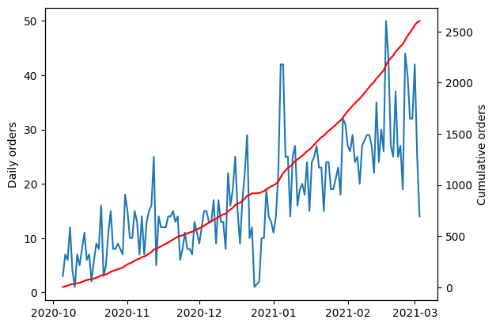
    


As previously stated in module 3, we will make a temporal split to prevent information leakeage.


```python
cumsum_daily_orders = daily_orders.cumsum() / daily_orders.sum()

train_val_cutoff = cumsum_daily_orders[cumsum_daily_orders < 0.7].idxmax()
val_test_cutoff = cumsum_daily_orders[cumsum_daily_orders < 0.9].idxmax()
print("Train since:", cumsum_daily_orders.index.min())
print("Train until:", train_val_cutoff)
print("Validation since:", train_val_cutoff)
print("Validation until:", val_test_cutoff)
print("Test since:", val_test_cutoff)
print("Test until:", cumsum_daily_orders.index.max())
```

    Train since: 2020-10-05
    Train until: 2021-02-04
    Validation since: 2021-02-04
    Validation until: 2021-02-22
    Test since: 2021-02-22
    Test until: 2021-03-03


```python
train_df = df_selected[df_selected.order_date <= train_val_cutoff]
val_df = df_selected[
    (df_selected.order_date > train_val_cutoff)
    & (df_selected.order_date <= val_test_cutoff)
]
test_df = df_selected[df_selected.order_date > val_test_cutoff]
```


```python
def feature_label_split(
    df: pd.DataFrame, target: str
) -> Tuple[pd.DataFrame, pd.Series]:
    return df.drop(columns=[target]), df[target]


X_train, y_train = feature_label_split(train_df, target)
X_val, y_val = feature_label_split(val_df, target)
X_test, y_test = feature_label_split(test_df, target)
train_cols = numerical_cols + binary_cols
```

# Base Model

In order to know if we are following the right path, we will start by creating a simple model that will serve as a baseline and benchmark for future models.  we will take a simple predictor as the baseline(column: `Global popularity`). Since we are dealing with a binary classification problem (purchased or not purchased), the metrics used will be: Precision-Recall curve and AUC-ROC curve. The Precision-Recall curve it's a specially good metric to use when the classes are imbalanced, as is the case here. All these metrics are based on the famous confusion matrix.


```python
def calculate_metrics(
    model_name: str,
    train_proba: pd.Series,
    y_train: pd.Series,
    val_proba: pd.Series,
    y_val: pd.Series,
):
    train_roc_auc = roc_auc_score(y_train, train_proba)
    train_crossentropy = log_loss(y_train, train_proba)
    train_ap = average_precision_score(y_train, train_proba)
    val_roc_auc = roc_auc_score(y_val, val_proba)
    val_crossentropy = log_loss(y_val, val_proba)
    val_ap = average_precision_score(y_val, val_proba)

    print(
        f"{model_name}: Train AUC = {train_roc_auc:.3f}, Val AUC = {val_roc_auc:.3f}; "
        f"Train AP = {train_ap:.3f}, Val AP = {val_ap:.3f}; "
        f"Train Crossentropy = {train_crossentropy:.3f}, Val Crossentropy = {val_crossentropy:.3f}"
    )
    return train_ap, val_ap, train_crossentropy, val_crossentropy


def plot_metrics(
    model_name: str,
    y_pred: pd.Series,
    y_test: pd.Series,
    figure: Tuple[matplotlib.figure.Figure, np.array] = None,
):
    precision_, recall_, _ = precision_recall_curve(y_test, y_pred)
    pr_auc = auc(recall_, precision_)
    fpr, tpr, _ = roc_curve(y_test, y_pred)
    roc_auc = roc_auc_score(y_test, y_pred)
    if figure is None:
        fig, ax = plt.subplots(1, 2, figsize=(17, 4))
    else:
        fig, ax = figure

    ax[0].plot(recall_, precision_, label=f"{model_name} (AUC = {pr_auc:.2f})")
    ax[0].set_xlabel("Recall")
    ax[0].set_ylabel("Precision")
    ax[0].set_title("Precision-Recall curve")
    ax[0].legend(loc="best")

    ax[1].plot(fpr, tpr, label=f"{model_name} (AUC = {roc_auc:.2f})")
    ax[1].set_xlabel("False Positive Rate")
    ax[1].set_ylabel("True Positive Rate")
    ax[1].set_title("ROC curve")
    ax[1].legend(loc="best")
```


```python
val_log_loss = []
val_avg_precision = []
calculate_metrics(
    "Baseline model",
    train_df["global_popularity"],
    y_train,
    val_df["global_popularity"],
    y_val,
)
plot_metrics(
    "Popularity baseline", y_pred=val_df["global_popularity"], y_test=val_df[target]
)
```

    Baseline model: Train AUC = 0.787, Val AUC = 0.787; Train AP = 0.060, Val AP = 0.066; Train Crossentropy = 0.070, Val Crossentropy = 0.064


    
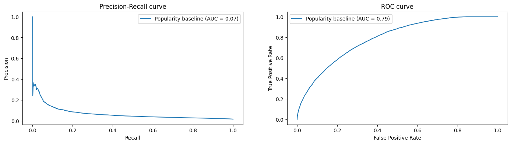
    


# Fitting models

## Random forest


```python
n_estimators = [5, 25, 50, 100]
train_log_loss = []
val_log_loss = []
train_avg_precision = []
val_avg_precision = []
fig1, ax1 = plt.subplots(1, 2, figsize=(17, 4))
fig1.suptitle("Train metrics")
fig2, ax2 = plt.subplots(1, 2, figsize=(17, 4))
fig2.suptitle("Validation metrics")

for tree_size in n_estimators:
    model = RandomForestClassifier(n_estimators=tree_size, random_state=0, n_jobs=-1)
    model.fit(X_train[train_cols], y_train)
    train_proba = model.predict_proba(X_train[train_cols])[:, 1]
    plot_metrics(
        f"RandomForestClassifier (n_estimators={tree_size})",
        train_proba,
        y_train,
        (fig1, ax1),
    )
    val_proba = model.predict_proba(X_val[train_cols])[:, 1]
    plot_metrics(
        f"RandomForestClassifier (n_estimators={tree_size})",
        val_proba,
        y_val,
        (fig2, ax2),
    )
    train_ap_, val_ap_, train_log_loss_, val_log_loss_ = calculate_metrics(
        f"RandomForestClassifier (n_estimators={tree_size})",
        train_proba,
        y_train,
        val_proba,
        y_val,
    )
    train_log_loss.append(train_log_loss_)
    val_log_loss.append(val_log_loss_)
    train_avg_precision.append(train_ap_)
    val_avg_precision.append(val_ap_)

plot_metrics(
    "Popularity baseline",
    y_pred=val_df["global_popularity"],
    y_test=val_df[target],
    figure=(fig2, ax2),
)

fig, ax = plt.subplots(1, 2, figsize=(14, 4))
ax[0].plot(n_estimators, train_log_loss, label="Train scores")
ax[0].plot(n_estimators, val_log_loss, label="val scores")
ax[0].plot(
    n_estimators[np.argmin(val_log_loss)],
    min(val_log_loss),
    marker="o",
    color="r",
    label="min val score",
)
ax[0].set_ylabel("Cross entropy loss")
ax[0].set_xlabel("n_estimators")
ax[0].legend(loc="best")
ax[0].set_title("Cross entropy loss vs n_estimators")

ax[1].plot(n_estimators, train_avg_precision, label="Train scores")
ax[1].plot(n_estimators, val_avg_precision, label="val scores")
ax[1].plot(
    n_estimators[np.argmax(val_avg_precision)],
    max(val_avg_precision),
    marker="o",
    color="r",
    label="max val score",
)
ax[1].set_ylabel("Average precision")
ax[1].set_xlabel("n_estimators")
ax[1].legend(loc="best")
ax[1].set_title("Average precision vs n_estimators")
```

    RandomForestClassifier (n_estimators=5): Train AUC = 0.991, Val AUC = 0.645; Train AP = 0.770, Val AP = 0.072; Train Crossentropy = 0.025, Val Crossentropy = 0.345
    RandomForestClassifier (n_estimators=25): Train AUC = 0.995, Val AUC = 0.714; Train AP = 0.852, Val AP = 0.111; Train Crossentropy = 0.021, Val Crossentropy = 0.251
    RandomForestClassifier (n_estimators=50): Train AUC = 0.996, Val AUC = 0.731; Train AP = 0.859, Val AP = 0.119; Train Crossentropy = 0.021, Val Crossentropy = 0.222
    RandomForestClassifier (n_estimators=100): Train AUC = 0.996, Val AUC = 0.749; Train AP = 0.863, Val AP = 0.125; Train Crossentropy = 0.021, Val Crossentropy = 0.190


    Text(0.5, 1.0, 'Average precision vs n_estimators')


    
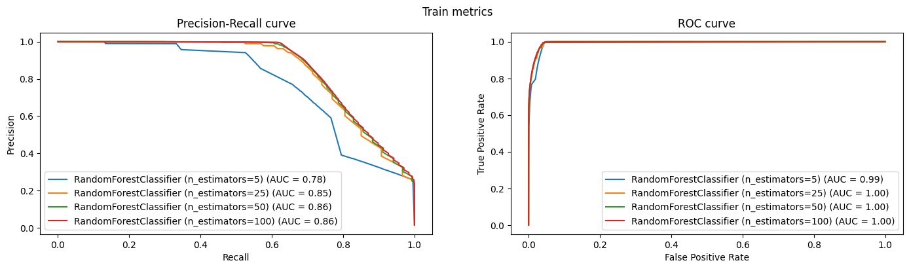
    


    
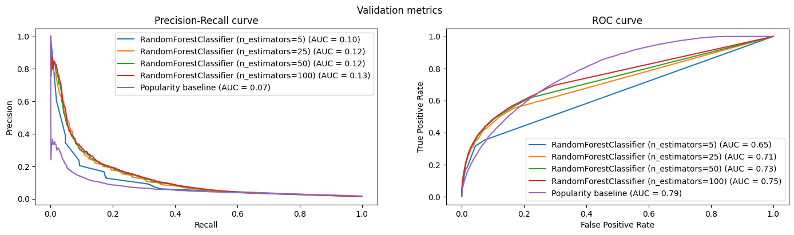
    


    
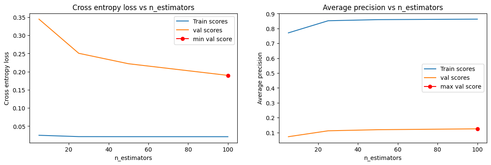
    


- RF with better peformance in all metrics(roc_AUC, PR_AUC, AP and CrossEntropy) are the ones with more trees. 
Let's keep the one with the most trees and try to find the most important features.


```python
rf = RandomForestClassifier(n_estimators=100, random_state=0, n_jobs=-1)
rf.fit(X_train[train_cols], y_train)
```


<style>#sk-container-id-1 {
  /* Definition of color scheme common for light and dark mode */
  --sklearn-color-text: black;
  --sklearn-color-line: gray;
  /* Definition of color scheme for unfitted estimators */
  --sklearn-color-unfitted-level-0: #fff5e6;
  --sklearn-color-unfitted-level-1: #f6e4d2;
  --sklearn-color-unfitted-level-2: #ffe0b3;
  --sklearn-color-unfitted-level-3: chocolate;
  /* Definition of color scheme for fitted estimators */
  --sklearn-color-fitted-level-0: #f0f8ff;
  --sklearn-color-fitted-level-1: #d4ebff;
  --sklearn-color-fitted-level-2: #b3dbfd;
  --sklearn-color-fitted-level-3: cornflowerblue;

  /* Specific color for light theme */
  --sklearn-color-text-on-default-background: var(--sg-text-color, var(--theme-code-foreground, var(--jp-content-font-color1, black)));
  --sklearn-color-background: var(--sg-background-color, var(--theme-background, var(--jp-layout-color0, white)));
  --sklearn-color-border-box: var(--sg-text-color, var(--theme-code-foreground, var(--jp-content-font-color1, black)));
  --sklearn-color-icon: #696969;

  @media (prefers-color-scheme: dark) {
    /* Redefinition of color scheme for dark theme */
    --sklearn-color-text-on-default-background: var(--sg-text-color, var(--theme-code-foreground, var(--jp-content-font-color1, white)));
    --sklearn-color-background: var(--sg-background-color, var(--theme-background, var(--jp-layout-color0, #111)));
    --sklearn-color-border-box: var(--sg-text-color, var(--theme-code-foreground, var(--jp-content-font-color1, white)));
    --sklearn-color-icon: #878787;
  }
}

#sk-container-id-1 {
  color: var(--sklearn-color-text);
}

#sk-container-id-1 pre {
  padding: 0;
}

#sk-container-id-1 input.sk-hidden--visually {
  border: 0;
  clip: rect(1px 1px 1px 1px);
  clip: rect(1px, 1px, 1px, 1px);
  height: 1px;
  margin: -1px;
  overflow: hidden;
  padding: 0;
  position: absolute;
  width: 1px;
}

#sk-container-id-1 div.sk-dashed-wrapped {
  border: 1px dashed var(--sklearn-color-line);
  margin: 0 0.4em 0.5em 0.4em;
  box-sizing: border-box;
  padding-bottom: 0.4em;
  background-color: var(--sklearn-color-background);
}

#sk-container-id-1 div.sk-container {
  /* jupyter's `normalize.less` sets `[hidden] { display: none; }`
     but bootstrap.min.css set `[hidden] { display: none !important; }`
     so we also need the `!important` here to be able to override the
     default hidden behavior on the sphinx rendered scikit-learn.org.
     See: https://github.com/scikit-learn/scikit-learn/issues/21755 */
  display: inline-block !important;
  position: relative;
}

#sk-container-id-1 div.sk-text-repr-fallback {
  display: none;
}

div.sk-parallel-item,
div.sk-serial,
div.sk-item {
  /* draw centered vertical line to link estimators */
  background-image: linear-gradient(var(--sklearn-color-text-on-default-background), var(--sklearn-color-text-on-default-background));
  background-size: 2px 100%;
  background-repeat: no-repeat;
  background-position: center center;
}

/* Parallel-specific style estimator block */

#sk-container-id-1 div.sk-parallel-item::after {
  content: "";
  width: 100%;
  border-bottom: 2px solid var(--sklearn-color-text-on-default-background);
  flex-grow: 1;
}

#sk-container-id-1 div.sk-parallel {
  display: flex;
  align-items: stretch;
  justify-content: center;
  background-color: var(--sklearn-color-background);
  position: relative;
}

#sk-container-id-1 div.sk-parallel-item {
  display: flex;
  flex-direction: column;
}

#sk-container-id-1 div.sk-parallel-item:first-child::after {
  align-self: flex-end;
  width: 50%;
}

#sk-container-id-1 div.sk-parallel-item:last-child::after {
  align-self: flex-start;
  width: 50%;
}

#sk-container-id-1 div.sk-parallel-item:only-child::after {
  width: 0;
}

/* Serial-specific style estimator block */

#sk-container-id-1 div.sk-serial {
  display: flex;
  flex-direction: column;
  align-items: center;
  background-color: var(--sklearn-color-background);
  padding-right: 1em;
  padding-left: 1em;
}


/* Toggleable style: style used for estimator/Pipeline/ColumnTransformer box that is
clickable and can be expanded/collapsed.
- Pipeline and ColumnTransformer use this feature and define the default style
- Estimators will overwrite some part of the style using the `sk-estimator` class
*/

/* Pipeline and ColumnTransformer style (default) */

#sk-container-id-1 div.sk-toggleable {
  /* Default theme specific background. It is overwritten whether we have a
  specific estimator or a Pipeline/ColumnTransformer */
  background-color: var(--sklearn-color-background);
}

/* Toggleable label */
#sk-container-id-1 label.sk-toggleable__label {
  cursor: pointer;
  display: block;
  width: 100%;
  margin-bottom: 0;
  padding: 0.5em;
  box-sizing: border-box;
  text-align: center;
}

#sk-container-id-1 label.sk-toggleable__label-arrow:before {
  /* Arrow on the left of the label */
  content: "▸";
  float: left;
  margin-right: 0.25em;
  color: var(--sklearn-color-icon);
}

#sk-container-id-1 label.sk-toggleable__label-arrow:hover:before {
  color: var(--sklearn-color-text);
}

/* Toggleable content - dropdown */

#sk-container-id-1 div.sk-toggleable__content {
  max-height: 0;
  max-width: 0;
  overflow: hidden;
  text-align: left;
  /* unfitted */
  background-color: var(--sklearn-color-unfitted-level-0);
}

#sk-container-id-1 div.sk-toggleable__content.fitted {
  /* fitted */
  background-color: var(--sklearn-color-fitted-level-0);
}

#sk-container-id-1 div.sk-toggleable__content pre {
  margin: 0.2em;
  border-radius: 0.25em;
  color: var(--sklearn-color-text);
  /* unfitted */
  background-color: var(--sklearn-color-unfitted-level-0);
}

#sk-container-id-1 div.sk-toggleable__content.fitted pre {
  /* unfitted */
  background-color: var(--sklearn-color-fitted-level-0);
}

#sk-container-id-1 input.sk-toggleable__control:checked~div.sk-toggleable__content {
  /* Expand drop-down */
  max-height: 200px;
  max-width: 100%;
  overflow: auto;
}

#sk-container-id-1 input.sk-toggleable__control:checked~label.sk-toggleable__label-arrow:before {
  content: "▾";
}

/* Pipeline/ColumnTransformer-specific style */

#sk-container-id-1 div.sk-label input.sk-toggleable__control:checked~label.sk-toggleable__label {
  color: var(--sklearn-color-text);
  background-color: var(--sklearn-color-unfitted-level-2);
}

#sk-container-id-1 div.sk-label.fitted input.sk-toggleable__control:checked~label.sk-toggleable__label {
  background-color: var(--sklearn-color-fitted-level-2);
}

/* Estimator-specific style */

/* Colorize estimator box */
#sk-container-id-1 div.sk-estimator input.sk-toggleable__control:checked~label.sk-toggleable__label {
  /* unfitted */
  background-color: var(--sklearn-color-unfitted-level-2);
}

#sk-container-id-1 div.sk-estimator.fitted input.sk-toggleable__control:checked~label.sk-toggleable__label {
  /* fitted */
  background-color: var(--sklearn-color-fitted-level-2);
}

#sk-container-id-1 div.sk-label label.sk-toggleable__label,
#sk-container-id-1 div.sk-label label {
  /* The background is the default theme color */
  color: var(--sklearn-color-text-on-default-background);
}

/* On hover, darken the color of the background */
#sk-container-id-1 div.sk-label:hover label.sk-toggleable__label {
  color: var(--sklearn-color-text);
  background-color: var(--sklearn-color-unfitted-level-2);
}

/* Label box, darken color on hover, fitted */
#sk-container-id-1 div.sk-label.fitted:hover label.sk-toggleable__label.fitted {
  color: var(--sklearn-color-text);
  background-color: var(--sklearn-color-fitted-level-2);
}

/* Estimator label */

#sk-container-id-1 div.sk-label label {
  font-family: monospace;
  font-weight: bold;
  display: inline-block;
  line-height: 1.2em;
}

#sk-container-id-1 div.sk-label-container {
  text-align: center;
}

/* Estimator-specific */
#sk-container-id-1 div.sk-estimator {
  font-family: monospace;
  border: 1px dotted var(--sklearn-color-border-box);
  border-radius: 0.25em;
  box-sizing: border-box;
  margin-bottom: 0.5em;
  /* unfitted */
  background-color: var(--sklearn-color-unfitted-level-0);
}

#sk-container-id-1 div.sk-estimator.fitted {
  /* fitted */
  background-color: var(--sklearn-color-fitted-level-0);
}

/* on hover */
#sk-container-id-1 div.sk-estimator:hover {
  /* unfitted */
  background-color: var(--sklearn-color-unfitted-level-2);
}

#sk-container-id-1 div.sk-estimator.fitted:hover {
  /* fitted */
  background-color: var(--sklearn-color-fitted-level-2);
}

/* Specification for estimator info (e.g. "i" and "?") */

/* Common style for "i" and "?" */

.sk-estimator-doc-link,
a:link.sk-estimator-doc-link,
a:visited.sk-estimator-doc-link {
  float: right;
  font-size: smaller;
  line-height: 1em;
  font-family: monospace;
  background-color: var(--sklearn-color-background);
  border-radius: 1em;
  height: 1em;
  width: 1em;
  text-decoration: none !important;
  margin-left: 1ex;
  /* unfitted */
  border: var(--sklearn-color-unfitted-level-1) 1pt solid;
  color: var(--sklearn-color-unfitted-level-1);
}

.sk-estimator-doc-link.fitted,
a:link.sk-estimator-doc-link.fitted,
a:visited.sk-estimator-doc-link.fitted {
  /* fitted */
  border: var(--sklearn-color-fitted-level-1) 1pt solid;
  color: var(--sklearn-color-fitted-level-1);
}

/* On hover */
div.sk-estimator:hover .sk-estimator-doc-link:hover,
.sk-estimator-doc-link:hover,
div.sk-label-container:hover .sk-estimator-doc-link:hover,
.sk-estimator-doc-link:hover {
  /* unfitted */
  background-color: var(--sklearn-color-unfitted-level-3);
  color: var(--sklearn-color-background);
  text-decoration: none;
}

div.sk-estimator.fitted:hover .sk-estimator-doc-link.fitted:hover,
.sk-estimator-doc-link.fitted:hover,
div.sk-label-container:hover .sk-estimator-doc-link.fitted:hover,
.sk-estimator-doc-link.fitted:hover {
  /* fitted */
  background-color: var(--sklearn-color-fitted-level-3);
  color: var(--sklearn-color-background);
  text-decoration: none;
}

/* Span, style for the box shown on hovering the info icon */
.sk-estimator-doc-link span {
  display: none;
  z-index: 9999;
  position: relative;
  font-weight: normal;
  right: .2ex;
  padding: .5ex;
  margin: .5ex;
  width: min-content;
  min-width: 20ex;
  max-width: 50ex;
  color: var(--sklearn-color-text);
  box-shadow: 2pt 2pt 4pt #999;
  /* unfitted */
  background: var(--sklearn-color-unfitted-level-0);
  border: .5pt solid var(--sklearn-color-unfitted-level-3);
}

.sk-estimator-doc-link.fitted span {
  /* fitted */
  background: var(--sklearn-color-fitted-level-0);
  border: var(--sklearn-color-fitted-level-3);
}

.sk-estimator-doc-link:hover span {
  display: block;
}

/* "?"-specific style due to the `<a>` HTML tag */

#sk-container-id-1 a.estimator_doc_link {
  float: right;
  font-size: 1rem;
  line-height: 1em;
  font-family: monospace;
  background-color: var(--sklearn-color-background);
  border-radius: 1rem;
  height: 1rem;
  width: 1rem;
  text-decoration: none;
  /* unfitted */
  color: var(--sklearn-color-unfitted-level-1);
  border: var(--sklearn-color-unfitted-level-1) 1pt solid;
}

#sk-container-id-1 a.estimator_doc_link.fitted {
  /* fitted */
  border: var(--sklearn-color-fitted-level-1) 1pt solid;
  color: var(--sklearn-color-fitted-level-1);
}

/* On hover */
#sk-container-id-1 a.estimator_doc_link:hover {
  /* unfitted */
  background-color: var(--sklearn-color-unfitted-level-3);
  color: var(--sklearn-color-background);
  text-decoration: none;
}

#sk-container-id-1 a.estimator_doc_link.fitted:hover {
  /* fitted */
  background-color: var(--sklearn-color-fitted-level-3);
}
</style><div id="sk-container-id-1" class="sk-top-container"><div class="sk-text-repr-fallback"><pre>RandomForestClassifier(n_jobs=-1, random_state=0)</pre><b>In a Jupyter environment, please rerun this cell to show the HTML representation or trust the notebook. <br />On GitHub, the HTML representation is unable to render, please try loading this page with nbviewer.org.</b></div><div class="sk-container" hidden><div class="sk-item"><div class="sk-estimator fitted sk-toggleable"><input class="sk-toggleable__control sk-hidden--visually" id="sk-estimator-id-1" type="checkbox" checked><label for="sk-estimator-id-1" class="sk-toggleable__label fitted sk-toggleable__label-arrow fitted">&nbsp;&nbsp;RandomForestClassifier<a class="sk-estimator-doc-link fitted" rel="noreferrer" target="_blank" href="https://scikit-learn.org/1.4/modules/generated/sklearn.ensemble.RandomForestClassifier.html">?<span>Documentation for RandomForestClassifier</span></a><span class="sk-estimator-doc-link fitted">i<span>Fitted</span></span></label><div class="sk-toggleable__content fitted"><pre>RandomForestClassifier(n_jobs=-1, random_state=0)</pre></div> </div></div></div></div>


```python
rf_importance_features = pd.DataFrame(
    {"features": train_cols, "importance": rf.feature_importances_}
).sort_values("importance", ascending=False)
sns.barplot(data=rf_importance_features, x="importance", y="features", hue="features")
```


    <Axes: xlabel='importance', ylabel='features'>


    
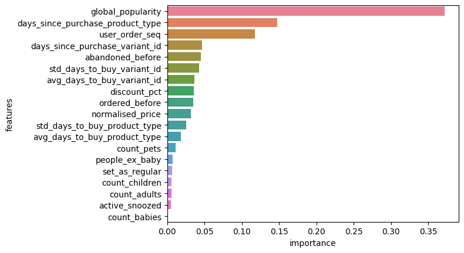
    


Let's remove the worst features and see if the model improves.


```python
important_cols = (
    rf_importance_features.sort_values("importance", ascending=False)
    .features[:15]
    .tolist()
)
important_cols
```


    ['global_popularity',
     'days_since_purchase_product_type',
     'user_order_seq',
     'days_since_purchase_variant_id',
     'abandoned_before',
     'std_days_to_buy_variant_id',
     'avg_days_to_buy_variant_id',
     'discount_pct',
     'ordered_before',
     'normalised_price',
     'std_days_to_buy_product_type',
     'avg_days_to_buy_product_type',
     'count_pets',
     'people_ex_baby',
     'set_as_regular']


```python
train_log_loss = []
val_log_loss = []
train_avg_precision = []
val_avg_precision = []

fig1, ax1 = plt.subplots(1, 2, figsize=(17, 4))
fig1.suptitle("Train metrics")
fig2, ax2 = plt.subplots(1, 2, figsize=(17, 4))
fig2.suptitle("Validation metrics")

for i in range(1, len(important_cols) + 1):
    rf.fit(X_train[important_cols[:i]], y_train)
    train_proba = rf.predict_proba(X_train[important_cols[:i]])[:, 1]
    plot_metrics(f"RF (n_features={i})", train_proba, y_train, (fig1, ax1))
    val_proba = rf.predict_proba(X_val[important_cols[:i]])[:, 1]
    plot_metrics(f"RF (n_features={i})", val_proba, y_val, (fig2, ax2))
    train_ap_, val_ap_, train_log_loss_, val_log_loss_ = calculate_metrics(
        f"RF (n_features={i})", train_proba, y_train, val_proba, y_val
    )
    train_log_loss.append(train_log_loss_)
    val_log_loss.append(val_log_loss_)
    train_avg_precision.append(train_ap_)
    val_avg_precision.append(val_ap_)

plot_metrics(
    "Popularity baseline",
    y_pred=val_df["global_popularity"],
    y_test=val_df[target],
    figure=(fig2, ax2),
)

fig, ax = plt.subplots(1, 2, figsize=(14, 4))
ax[0].plot(range(1, len(important_cols) + 1), train_log_loss, label="Train scores")
ax[0].plot(range(1, len(important_cols) + 1), val_log_loss, label="val scores")
ax[0].plot(
    range(1, len(important_cols) + 1)[np.argmin(val_log_loss)],
    min(val_log_loss),
    marker="o",
    color="r",
    label="min val score",
)
ax[0].set_ylabel("Cross entropy loss")
ax[0].set_xlabel("n_features")
ax[0].legend(loc="best")
ax[0].set_title("Cross entropy loss vs n_features")

ax[1].plot(range(1, len(important_cols) + 1), train_avg_precision, label="Train scores")
ax[1].plot(range(1, len(important_cols) + 1), val_avg_precision, label="val scores")
ax[1].plot(
    range(1, len(important_cols) + 1)[np.argmax(val_avg_precision)],
    max(val_avg_precision),
    marker="o",
    color="r",
    label="max val score",
)
ax[1].set_ylabel("Average precision")
ax[1].set_xlabel("n_features")
ax[1].legend(loc="best")
ax[1].set_title("Average precision vs n_features")
```

    RF (n_features=1): Train AUC = 0.808, Val AUC = 0.730; Train AP = 0.080, Val AP = 0.051; Train Crossentropy = 0.067, Val Crossentropy = 0.089
    RF (n_features=2): Train AUC = 0.898, Val AUC = 0.600; Train AP = 0.296, Val AP = 0.037; Train Crossentropy = 0.055, Val Crossentropy = 0.206
    RF (n_features=3): Train AUC = 0.929, Val AUC = 0.635; Train AP = 0.356, Val AP = 0.038; Train Crossentropy = 0.050, Val Crossentropy = 0.208
    RF (n_features=4): Train AUC = 0.934, Val AUC = 0.699; Train AP = 0.448, Val AP = 0.085; Train Crossentropy = 0.046, Val Crossentropy = 0.174
    RF (n_features=5): Train AUC = 0.939, Val AUC = 0.693; Train AP = 0.486, Val AP = 0.097; Train Crossentropy = 0.044, Val Crossentropy = 0.185
    RF (n_features=6): Train AUC = 0.995, Val AUC = 0.738; Train AP = 0.827, Val AP = 0.112; Train Crossentropy = 0.023, Val Crossentropy = 0.194
    RF (n_features=7): Train AUC = 0.995, Val AUC = 0.743; Train AP = 0.828, Val AP = 0.112; Train Crossentropy = 0.023, Val Crossentropy = 0.178
    RF (n_features=8): Train AUC = 0.995, Val AUC = 0.741; Train AP = 0.827, Val AP = 0.108; Train Crossentropy = 0.023, Val Crossentropy = 0.181
    RF (n_features=9): Train AUC = 0.995, Val AUC = 0.750; Train AP = 0.849, Val AP = 0.114; Train Crossentropy = 0.021, Val Crossentropy = 0.172
    RF (n_features=10): Train AUC = 0.995, Val AUC = 0.744; Train AP = 0.848, Val AP = 0.113; Train Crossentropy = 0.021, Val Crossentropy = 0.180
    RF (n_features=11): Train AUC = 0.995, Val AUC = 0.741; Train AP = 0.847, Val AP = 0.112; Train Crossentropy = 0.021, Val Crossentropy = 0.188
    RF (n_features=12): Train AUC = 0.995, Val AUC = 0.738; Train AP = 0.847, Val AP = 0.109; Train Crossentropy = 0.021, Val Crossentropy = 0.193
    RF (n_features=13): Train AUC = 0.995, Val AUC = 0.738; Train AP = 0.855, Val AP = 0.110; Train Crossentropy = 0.021, Val Crossentropy = 0.196
    RF (n_features=14): Train AUC = 0.996, Val AUC = 0.736; Train AP = 0.859, Val AP = 0.108; Train Crossentropy = 0.021, Val Crossentropy = 0.199
    RF (n_features=15): Train AUC = 0.996, Val AUC = 0.747; Train AP = 0.861, Val AP = 0.122; Train Crossentropy = 0.021, Val Crossentropy = 0.193


    Text(0.5, 1.0, 'Average precision vs n_features')


    
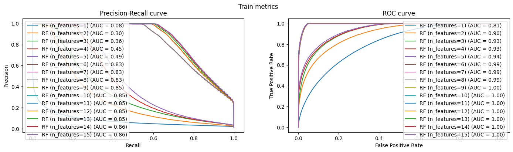
    


    
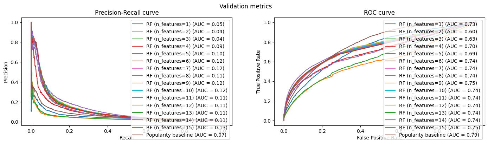
    


    
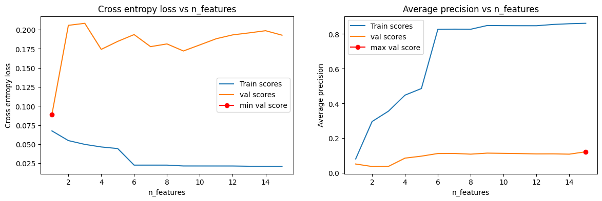
    


- Although, from the 8th feature onwards the improvements are minimal, it seems RF works best with all features.

## GBT


```python
max_iter = [5, 10, 25, 50, 100]
lr = [0.01, 0.05, 0.1]
max_depth = [1, 5, 10]
train_log_loss = []
val_log_loss = []
train_avg_precision = []
val_avg_precision = []
model_performance = []

fig1, ax1 = plt.subplots(1, 2, figsize=(17, 4))
fig1.suptitle("Train metrics")
fig2, ax2 = plt.subplots(1, 2, figsize=(17, 4))
fig2.suptitle("Validation metrics")

time_start = time.time()
for max_iter in max_iter:
    for learning_rate in lr:
        for depth in max_depth:
            model = HistGradientBoostingClassifier(
                max_iter=max_iter,
                learning_rate=learning_rate,
                max_depth=depth,
                random_state=0,
            )
            model.fit(X_train[train_cols], y_train)
            train_proba = model.predict_proba(X_train[train_cols])[:, 1]
            val_proba = model.predict_proba(X_val[train_cols])[:, 1]
            model_performance.append(
                {
                    "model": f"max_iter={max_iter}, learning_rate={learning_rate}, max_depth={depth}",
                    "train_proba": train_proba,
                    "val_proba": val_proba,
                    "val_avg_precision": average_precision_score(y_val, val_proba),
                }
            )
time_end = time.time()
print(f"Training took {time_end - time_start:.2f} seconds")
# Sort the models based on validation AP (descending, since higher AP is better)
sorted_models = sorted(
    model_performance, key=lambda x: x["val_avg_precision"], reverse=True
)
print("Top 5 Models based on Validation Val AP:")
for model_info in sorted_models[:5]:
    calculate_metrics(
        model_info["model"],
        model_info["train_proba"],
        y_train,
        model_info["val_proba"],
        y_val,
    )
    plot_metrics(model_info["model"], model_info["train_proba"], y_train, (fig1, ax1))
    plot_metrics(model_info["model"], model_info["val_proba"], y_val, (fig2, ax2))
plot_metrics(
    "Popularity baseline",
    y_pred=val_df["global_popularity"],
    y_test=val_df[target],
    figure=(fig2, ax2),
)
```

    Training took 128.38 seconds
    Top 5 Models based on Validation Val AP:
    max_iter=100, learning_rate=0.05, max_depth=10: Train AUC = 0.852, Val AUC = 0.847; Train AP = 0.219, Val AP = 0.197; Train Crossentropy = 0.060, Val Crossentropy = 0.056
    max_iter=50, learning_rate=0.05, max_depth=10: Train AUC = 0.848, Val AUC = 0.847; Train AP = 0.209, Val AP = 0.196; Train Crossentropy = 0.061, Val Crossentropy = 0.056
    max_iter=50, learning_rate=0.05, max_depth=5: Train AUC = 0.843, Val AUC = 0.846; Train AP = 0.207, Val AP = 0.195; Train Crossentropy = 0.062, Val Crossentropy = 0.056
    max_iter=25, learning_rate=0.05, max_depth=10: Train AUC = 0.844, Val AUC = 0.846; Train AP = 0.205, Val AP = 0.195; Train Crossentropy = 0.063, Val Crossentropy = 0.057
    max_iter=100, learning_rate=0.05, max_depth=5: Train AUC = 0.846, Val AUC = 0.847; Train AP = 0.211, Val AP = 0.195; Train Crossentropy = 0.061, Val Crossentropy = 0.056


    
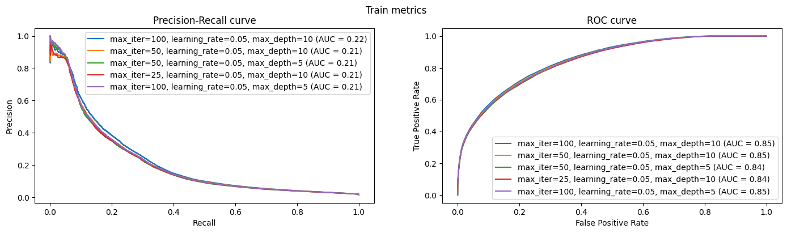
    


    
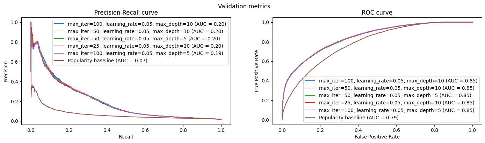
    


- Much better performance than RF in all metrics. 
- The best model has the following hyperparameters: 100 iterations, learning rate of 0.05 and and max depth of 10. Nevertheless, the difference between the bests gbt models is insignificant.

As we did with RF, let's remove the worst features and see if the model improves.


```python
best_GBT = HistGradientBoostingClassifier(
    max_iter=100, learning_rate=0.05, max_depth=10, random_state=0
)
best_GBT.fit(X_train[train_cols], y_train)
```


<style>#sk-container-id-3 {
  /* Definition of color scheme common for light and dark mode */
  --sklearn-color-text: black;
  --sklearn-color-line: gray;
  /* Definition of color scheme for unfitted estimators */
  --sklearn-color-unfitted-level-0: #fff5e6;
  --sklearn-color-unfitted-level-1: #f6e4d2;
  --sklearn-color-unfitted-level-2: #ffe0b3;
  --sklearn-color-unfitted-level-3: chocolate;
  /* Definition of color scheme for fitted estimators */
  --sklearn-color-fitted-level-0: #f0f8ff;
  --sklearn-color-fitted-level-1: #d4ebff;
  --sklearn-color-fitted-level-2: #b3dbfd;
  --sklearn-color-fitted-level-3: cornflowerblue;

  /* Specific color for light theme */
  --sklearn-color-text-on-default-background: var(--sg-text-color, var(--theme-code-foreground, var(--jp-content-font-color1, black)));
  --sklearn-color-background: var(--sg-background-color, var(--theme-background, var(--jp-layout-color0, white)));
  --sklearn-color-border-box: var(--sg-text-color, var(--theme-code-foreground, var(--jp-content-font-color1, black)));
  --sklearn-color-icon: #696969;

  @media (prefers-color-scheme: dark) {
    /* Redefinition of color scheme for dark theme */
    --sklearn-color-text-on-default-background: var(--sg-text-color, var(--theme-code-foreground, var(--jp-content-font-color1, white)));
    --sklearn-color-background: var(--sg-background-color, var(--theme-background, var(--jp-layout-color0, #111)));
    --sklearn-color-border-box: var(--sg-text-color, var(--theme-code-foreground, var(--jp-content-font-color1, white)));
    --sklearn-color-icon: #878787;
  }
}

#sk-container-id-3 {
  color: var(--sklearn-color-text);
}

#sk-container-id-3 pre {
  padding: 0;
}

#sk-container-id-3 input.sk-hidden--visually {
  border: 0;
  clip: rect(1px 1px 1px 1px);
  clip: rect(1px, 1px, 1px, 1px);
  height: 1px;
  margin: -1px;
  overflow: hidden;
  padding: 0;
  position: absolute;
  width: 1px;
}

#sk-container-id-3 div.sk-dashed-wrapped {
  border: 1px dashed var(--sklearn-color-line);
  margin: 0 0.4em 0.5em 0.4em;
  box-sizing: border-box;
  padding-bottom: 0.4em;
  background-color: var(--sklearn-color-background);
}

#sk-container-id-3 div.sk-container {
  /* jupyter's `normalize.less` sets `[hidden] { display: none; }`
     but bootstrap.min.css set `[hidden] { display: none !important; }`
     so we also need the `!important` here to be able to override the
     default hidden behavior on the sphinx rendered scikit-learn.org.
     See: https://github.com/scikit-learn/scikit-learn/issues/21755 */
  display: inline-block !important;
  position: relative;
}

#sk-container-id-3 div.sk-text-repr-fallback {
  display: none;
}

div.sk-parallel-item,
div.sk-serial,
div.sk-item {
  /* draw centered vertical line to link estimators */
  background-image: linear-gradient(var(--sklearn-color-text-on-default-background), var(--sklearn-color-text-on-default-background));
  background-size: 2px 100%;
  background-repeat: no-repeat;
  background-position: center center;
}

/* Parallel-specific style estimator block */

#sk-container-id-3 div.sk-parallel-item::after {
  content: "";
  width: 100%;
  border-bottom: 2px solid var(--sklearn-color-text-on-default-background);
  flex-grow: 1;
}

#sk-container-id-3 div.sk-parallel {
  display: flex;
  align-items: stretch;
  justify-content: center;
  background-color: var(--sklearn-color-background);
  position: relative;
}

#sk-container-id-3 div.sk-parallel-item {
  display: flex;
  flex-direction: column;
}

#sk-container-id-3 div.sk-parallel-item:first-child::after {
  align-self: flex-end;
  width: 50%;
}

#sk-container-id-3 div.sk-parallel-item:last-child::after {
  align-self: flex-start;
  width: 50%;
}

#sk-container-id-3 div.sk-parallel-item:only-child::after {
  width: 0;
}

/* Serial-specific style estimator block */

#sk-container-id-3 div.sk-serial {
  display: flex;
  flex-direction: column;
  align-items: center;
  background-color: var(--sklearn-color-background);
  padding-right: 1em;
  padding-left: 1em;
}


/* Toggleable style: style used for estimator/Pipeline/ColumnTransformer box that is
clickable and can be expanded/collapsed.
- Pipeline and ColumnTransformer use this feature and define the default style
- Estimators will overwrite some part of the style using the `sk-estimator` class
*/

/* Pipeline and ColumnTransformer style (default) */

#sk-container-id-3 div.sk-toggleable {
  /* Default theme specific background. It is overwritten whether we have a
  specific estimator or a Pipeline/ColumnTransformer */
  background-color: var(--sklearn-color-background);
}

/* Toggleable label */
#sk-container-id-3 label.sk-toggleable__label {
  cursor: pointer;
  display: block;
  width: 100%;
  margin-bottom: 0;
  padding: 0.5em;
  box-sizing: border-box;
  text-align: center;
}

#sk-container-id-3 label.sk-toggleable__label-arrow:before {
  /* Arrow on the left of the label */
  content: "▸";
  float: left;
  margin-right: 0.25em;
  color: var(--sklearn-color-icon);
}

#sk-container-id-3 label.sk-toggleable__label-arrow:hover:before {
  color: var(--sklearn-color-text);
}

/* Toggleable content - dropdown */

#sk-container-id-3 div.sk-toggleable__content {
  max-height: 0;
  max-width: 0;
  overflow: hidden;
  text-align: left;
  /* unfitted */
  background-color: var(--sklearn-color-unfitted-level-0);
}

#sk-container-id-3 div.sk-toggleable__content.fitted {
  /* fitted */
  background-color: var(--sklearn-color-fitted-level-0);
}

#sk-container-id-3 div.sk-toggleable__content pre {
  margin: 0.2em;
  border-radius: 0.25em;
  color: var(--sklearn-color-text);
  /* unfitted */
  background-color: var(--sklearn-color-unfitted-level-0);
}

#sk-container-id-3 div.sk-toggleable__content.fitted pre {
  /* unfitted */
  background-color: var(--sklearn-color-fitted-level-0);
}

#sk-container-id-3 input.sk-toggleable__control:checked~div.sk-toggleable__content {
  /* Expand drop-down */
  max-height: 200px;
  max-width: 100%;
  overflow: auto;
}

#sk-container-id-3 input.sk-toggleable__control:checked~label.sk-toggleable__label-arrow:before {
  content: "▾";
}

/* Pipeline/ColumnTransformer-specific style */

#sk-container-id-3 div.sk-label input.sk-toggleable__control:checked~label.sk-toggleable__label {
  color: var(--sklearn-color-text);
  background-color: var(--sklearn-color-unfitted-level-2);
}

#sk-container-id-3 div.sk-label.fitted input.sk-toggleable__control:checked~label.sk-toggleable__label {
  background-color: var(--sklearn-color-fitted-level-2);
}

/* Estimator-specific style */

/* Colorize estimator box */
#sk-container-id-3 div.sk-estimator input.sk-toggleable__control:checked~label.sk-toggleable__label {
  /* unfitted */
  background-color: var(--sklearn-color-unfitted-level-2);
}

#sk-container-id-3 div.sk-estimator.fitted input.sk-toggleable__control:checked~label.sk-toggleable__label {
  /* fitted */
  background-color: var(--sklearn-color-fitted-level-2);
}

#sk-container-id-3 div.sk-label label.sk-toggleable__label,
#sk-container-id-3 div.sk-label label {
  /* The background is the default theme color */
  color: var(--sklearn-color-text-on-default-background);
}

/* On hover, darken the color of the background */
#sk-container-id-3 div.sk-label:hover label.sk-toggleable__label {
  color: var(--sklearn-color-text);
  background-color: var(--sklearn-color-unfitted-level-2);
}

/* Label box, darken color on hover, fitted */
#sk-container-id-3 div.sk-label.fitted:hover label.sk-toggleable__label.fitted {
  color: var(--sklearn-color-text);
  background-color: var(--sklearn-color-fitted-level-2);
}

/* Estimator label */

#sk-container-id-3 div.sk-label label {
  font-family: monospace;
  font-weight: bold;
  display: inline-block;
  line-height: 1.2em;
}

#sk-container-id-3 div.sk-label-container {
  text-align: center;
}

/* Estimator-specific */
#sk-container-id-3 div.sk-estimator {
  font-family: monospace;
  border: 1px dotted var(--sklearn-color-border-box);
  border-radius: 0.25em;
  box-sizing: border-box;
  margin-bottom: 0.5em;
  /* unfitted */
  background-color: var(--sklearn-color-unfitted-level-0);
}

#sk-container-id-3 div.sk-estimator.fitted {
  /* fitted */
  background-color: var(--sklearn-color-fitted-level-0);
}

/* on hover */
#sk-container-id-3 div.sk-estimator:hover {
  /* unfitted */
  background-color: var(--sklearn-color-unfitted-level-2);
}

#sk-container-id-3 div.sk-estimator.fitted:hover {
  /* fitted */
  background-color: var(--sklearn-color-fitted-level-2);
}

/* Specification for estimator info (e.g. "i" and "?") */

/* Common style for "i" and "?" */

.sk-estimator-doc-link,
a:link.sk-estimator-doc-link,
a:visited.sk-estimator-doc-link {
  float: right;
  font-size: smaller;
  line-height: 1em;
  font-family: monospace;
  background-color: var(--sklearn-color-background);
  border-radius: 1em;
  height: 1em;
  width: 1em;
  text-decoration: none !important;
  margin-left: 1ex;
  /* unfitted */
  border: var(--sklearn-color-unfitted-level-1) 1pt solid;
  color: var(--sklearn-color-unfitted-level-1);
}

.sk-estimator-doc-link.fitted,
a:link.sk-estimator-doc-link.fitted,
a:visited.sk-estimator-doc-link.fitted {
  /* fitted */
  border: var(--sklearn-color-fitted-level-1) 1pt solid;
  color: var(--sklearn-color-fitted-level-1);
}

/* On hover */
div.sk-estimator:hover .sk-estimator-doc-link:hover,
.sk-estimator-doc-link:hover,
div.sk-label-container:hover .sk-estimator-doc-link:hover,
.sk-estimator-doc-link:hover {
  /* unfitted */
  background-color: var(--sklearn-color-unfitted-level-3);
  color: var(--sklearn-color-background);
  text-decoration: none;
}

div.sk-estimator.fitted:hover .sk-estimator-doc-link.fitted:hover,
.sk-estimator-doc-link.fitted:hover,
div.sk-label-container:hover .sk-estimator-doc-link.fitted:hover,
.sk-estimator-doc-link.fitted:hover {
  /* fitted */
  background-color: var(--sklearn-color-fitted-level-3);
  color: var(--sklearn-color-background);
  text-decoration: none;
}

/* Span, style for the box shown on hovering the info icon */
.sk-estimator-doc-link span {
  display: none;
  z-index: 9999;
  position: relative;
  font-weight: normal;
  right: .2ex;
  padding: .5ex;
  margin: .5ex;
  width: min-content;
  min-width: 20ex;
  max-width: 50ex;
  color: var(--sklearn-color-text);
  box-shadow: 2pt 2pt 4pt #999;
  /* unfitted */
  background: var(--sklearn-color-unfitted-level-0);
  border: .5pt solid var(--sklearn-color-unfitted-level-3);
}

.sk-estimator-doc-link.fitted span {
  /* fitted */
  background: var(--sklearn-color-fitted-level-0);
  border: var(--sklearn-color-fitted-level-3);
}

.sk-estimator-doc-link:hover span {
  display: block;
}

/* "?"-specific style due to the `<a>` HTML tag */

#sk-container-id-3 a.estimator_doc_link {
  float: right;
  font-size: 1rem;
  line-height: 1em;
  font-family: monospace;
  background-color: var(--sklearn-color-background);
  border-radius: 1rem;
  height: 1rem;
  width: 1rem;
  text-decoration: none;
  /* unfitted */
  color: var(--sklearn-color-unfitted-level-1);
  border: var(--sklearn-color-unfitted-level-1) 1pt solid;
}

#sk-container-id-3 a.estimator_doc_link.fitted {
  /* fitted */
  border: var(--sklearn-color-fitted-level-1) 1pt solid;
  color: var(--sklearn-color-fitted-level-1);
}

/* On hover */
#sk-container-id-3 a.estimator_doc_link:hover {
  /* unfitted */
  background-color: var(--sklearn-color-unfitted-level-3);
  color: var(--sklearn-color-background);
  text-decoration: none;
}

#sk-container-id-3 a.estimator_doc_link.fitted:hover {
  /* fitted */
  background-color: var(--sklearn-color-fitted-level-3);
}
</style><div id="sk-container-id-3" class="sk-top-container"><div class="sk-text-repr-fallback"><pre>HistGradientBoostingClassifier(learning_rate=0.05, max_depth=10, random_state=0)</pre><b>In a Jupyter environment, please rerun this cell to show the HTML representation or trust the notebook. <br />On GitHub, the HTML representation is unable to render, please try loading this page with nbviewer.org.</b></div><div class="sk-container" hidden><div class="sk-item"><div class="sk-estimator fitted sk-toggleable"><input class="sk-toggleable__control sk-hidden--visually" id="sk-estimator-id-3" type="checkbox" checked><label for="sk-estimator-id-3" class="sk-toggleable__label fitted sk-toggleable__label-arrow fitted">&nbsp;&nbsp;HistGradientBoostingClassifier<a class="sk-estimator-doc-link fitted" rel="noreferrer" target="_blank" href="https://scikit-learn.org/1.4/modules/generated/sklearn.ensemble.HistGradientBoostingClassifier.html">?<span>Documentation for HistGradientBoostingClassifier</span></a><span class="sk-estimator-doc-link fitted">i<span>Fitted</span></span></label><div class="sk-toggleable__content fitted"><pre>HistGradientBoostingClassifier(learning_rate=0.05, max_depth=10, random_state=0)</pre></div> </div></div></div></div>


```python
from sklearn.inspection import permutation_importance

# Histogram-based Gradient Boosting Trees doens't have a feature_importances_ attribute, so we use permutation_importance method instead.
result = permutation_importance(
    best_GBT,
    X_train[train_cols],
    y_train,
    scoring="average_precision",
    n_repeats=5,
    random_state=0,
    n_jobs=-1,
)
```


```python
gbt_importance_features = pd.DataFrame(
    {
        "features": train_cols,
        "importances_mean": result.importances_mean,
        "importances_std": result.importances_std,
    }
).sort_values("importances_mean", ascending=False)
```


```python
import seaborn as sns

sns.barplot(
    data=gbt_importance_features, x="importances_mean", y="features", hue="features"
).errorbar(
    x=gbt_importance_features.importances_mean,
    y=gbt_importance_features.features,
    xerr=gbt_importance_features.importances_std,
    fmt="none",
    linewidth=5,
    c="black",
)
```


    <ErrorbarContainer object of 3 artists>


    
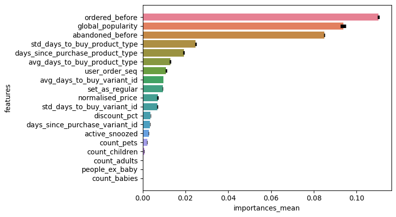
    


```python
gbt_columns = gbt_importance_features.sort_values(
    "importances_mean", ascending=False
).features[:15]
gbt_columns
```


    15                      ordered_before
    3                    global_popularity
    16                    abandoned_before
    14        std_days_to_buy_product_type
    12    days_since_purchase_product_type
    13        avg_days_to_buy_product_type
    0                       user_order_seq
    10          avg_days_to_buy_variant_id
    18                      set_as_regular
    1                     normalised_price
    11          std_days_to_buy_variant_id
    2                         discount_pct
    9       days_since_purchase_variant_id
    17                      active_snoozed
    7                           count_pets
    Name: features, dtype: object


```python
for i in range(1, len(gbt_columns) + 1):
    best_GBT.fit(X_train[gbt_columns[:i]], y_train)
    train_proba = best_GBT.predict_proba(X_train[gbt_columns[:i]])[:, 1]
    val_proba = best_GBT.predict_proba(X_val[gbt_columns[:i]])[:, 1]
    calculate_metrics(f"GBT (top {i} features)", train_proba, y_train, val_proba, y_val)
    plot_metrics(f"GBT (top {i} features)", val_proba, y_val, (fig2, ax2))
```

    GBT (top 1 features): Train AUC = 0.628, Val AUC = 0.648; Train AP = 0.055, Val AP = 0.066; Train Crossentropy = 0.071, Val Crossentropy = 0.064
    GBT (top 2 features): Train AUC = 0.828, Val AUC = 0.832; Train AP = 0.123, Val AP = 0.144; Train Crossentropy = 0.064, Val Crossentropy = 0.058
    GBT (top 3 features): Train AUC = 0.835, Val AUC = 0.835; Train AP = 0.179, Val AP = 0.159; Train Crossentropy = 0.063, Val Crossentropy = 0.057
    GBT (top 4 features): Train AUC = 0.840, Val AUC = 0.835; Train AP = 0.194, Val AP = 0.176; Train Crossentropy = 0.062, Val Crossentropy = 0.057
    GBT (top 5 features): Train AUC = 0.845, Val AUC = 0.838; Train AP = 0.200, Val AP = 0.177; Train Crossentropy = 0.061, Val Crossentropy = 0.057
    GBT (top 6 features): Train AUC = 0.845, Val AUC = 0.838; Train AP = 0.202, Val AP = 0.176; Train Crossentropy = 0.061, Val Crossentropy = 0.057
    GBT (top 7 features): Train AUC = 0.846, Val AUC = 0.840; Train AP = 0.206, Val AP = 0.181; Train Crossentropy = 0.061, Val Crossentropy = 0.057
    GBT (top 8 features): Train AUC = 0.848, Val AUC = 0.840; Train AP = 0.208, Val AP = 0.180; Train Crossentropy = 0.061, Val Crossentropy = 0.057
    GBT (top 9 features): Train AUC = 0.849, Val AUC = 0.846; Train AP = 0.213, Val AP = 0.194; Train Crossentropy = 0.061, Val Crossentropy = 0.056
    GBT (top 10 features): Train AUC = 0.850, Val AUC = 0.847; Train AP = 0.214, Val AP = 0.194; Train Crossentropy = 0.061, Val Crossentropy = 0.056
    GBT (top 11 features): Train AUC = 0.851, Val AUC = 0.846; Train AP = 0.215, Val AP = 0.195; Train Crossentropy = 0.061, Val Crossentropy = 0.056
    GBT (top 12 features): Train AUC = 0.851, Val AUC = 0.846; Train AP = 0.216, Val AP = 0.193; Train Crossentropy = 0.061, Val Crossentropy = 0.056
    GBT (top 13 features): Train AUC = 0.851, Val AUC = 0.846; Train AP = 0.217, Val AP = 0.194; Train Crossentropy = 0.061, Val Crossentropy = 0.056
    GBT (top 14 features): Train AUC = 0.851, Val AUC = 0.846; Train AP = 0.218, Val AP = 0.196; Train Crossentropy = 0.061, Val Crossentropy = 0.056
    GBT (top 15 features): Train AUC = 0.852, Val AUC = 0.847; Train AP = 0.219, Val AP = 0.196; Train Crossentropy = 0.060, Val Crossentropy = 0.056


From the 10th feature onwards, the performance of the GBT model does not improve significantly. Therefore, we will keep the model with the 9 most important features.

## Comparison best models:


```python
best_GBT = HistGradientBoostingClassifier(
    max_iter=100, learning_rate=0.05, max_depth=10, random_state=0
)
best_GBT.fit(X_train[gbt_columns[:9]], y_train)

best_RF = RandomForestClassifier(n_estimators=100, random_state=0, n_jobs=-1)
best_RF.fit(X_train[train_cols], y_train)

# best model from module 3: Logistic Regression
from sklearn.linear_model import LogisticRegression

LR_cols = ["ordered_before", "abandoned_before", "global_popularity"]
best_LR = Pipeline(
    steps=[
        ("scaler", StandardScaler()),
        ("classifier", LogisticRegression(penalty="l2", C=1e-6)),
    ]
)
best_LR.fit(X_train[LR_cols], y_train)

# comparing results
fig2, ax2 = plt.subplots(1, 2, figsize=(17, 4))
fig2.suptitle("Validation metrics")

calculate_metrics(
    "GBT",
    best_GBT.predict_proba(X_train[gbt_columns[:9]])[:, 1],
    y_train,
    best_GBT.predict_proba(X_val[gbt_columns[:9]])[:, 1],
    y_val,
)
plot_metrics(
    "GBT", best_GBT.predict_proba(X_val[gbt_columns[:9]])[:, 1], y_val, (fig2, ax2)
)

calculate_metrics(
    "RF",
    best_RF.predict_proba(X_train[train_cols])[:, 1],
    y_train,
    best_RF.predict_proba(X_val[train_cols])[:, 1],
    y_val,
)
plot_metrics("RF", best_RF.predict_proba(X_val[train_cols])[:, 1], y_val, (fig2, ax2))

calculate_metrics(
    "LR",
    best_LR.predict_proba(X_train[LR_cols])[:, 1],
    y_train,
    best_LR.predict_proba(X_val[LR_cols])[:, 1],
    y_val,
)
plot_metrics("LR", best_LR.predict_proba(X_val[LR_cols])[:, 1], y_val, (fig2, ax2))

calculate_metrics(
    "Popularity baseline",
    train_df["global_popularity"],
    y_train,
    val_df["global_popularity"],
    y_val,
)
plot_metrics("Popularity baseline", val_df["global_popularity"], y_val, (fig2, ax2))
```

    GBT: Train AUC = 0.849, Val AUC = 0.846; Train AP = 0.213, Val AP = 0.194; Train Crossentropy = 0.061, Val Crossentropy = 0.056
    RF: Train AUC = 0.996, Val AUC = 0.749; Train AP = 0.863, Val AP = 0.125; Train Crossentropy = 0.021, Val Crossentropy = 0.190
    LR: Train AUC = 0.833, Val AUC = 0.834; Train AP = 0.163, Val AP = 0.148; Train Crossentropy = 0.076, Val Crossentropy = 0.070
    Popularity baseline: Train AUC = 0.787, Val AUC = 0.787; Train AP = 0.060, Val AP = 0.066; Train Crossentropy = 0.070, Val Crossentropy = 0.064


    
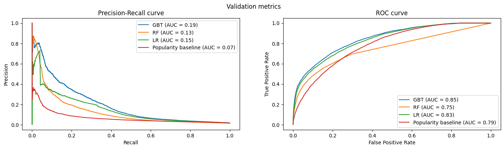
    


- Most of module 4 work was based upon the previous module 3 work with linear models and module 2 work with EDA focus.
- Different non-linear ML models were tested and compared: Random Forest and Gradient Boosting Trees.
- Hyperparameters were tuned without using a cross-validation approach. A time series split was used instead.
- Importance of features was also evaluated. 
- The GBT model is the best model, with a better performance in all metrics.
- The cutoff point for the GBT model will be determined according to business team requirements. 
